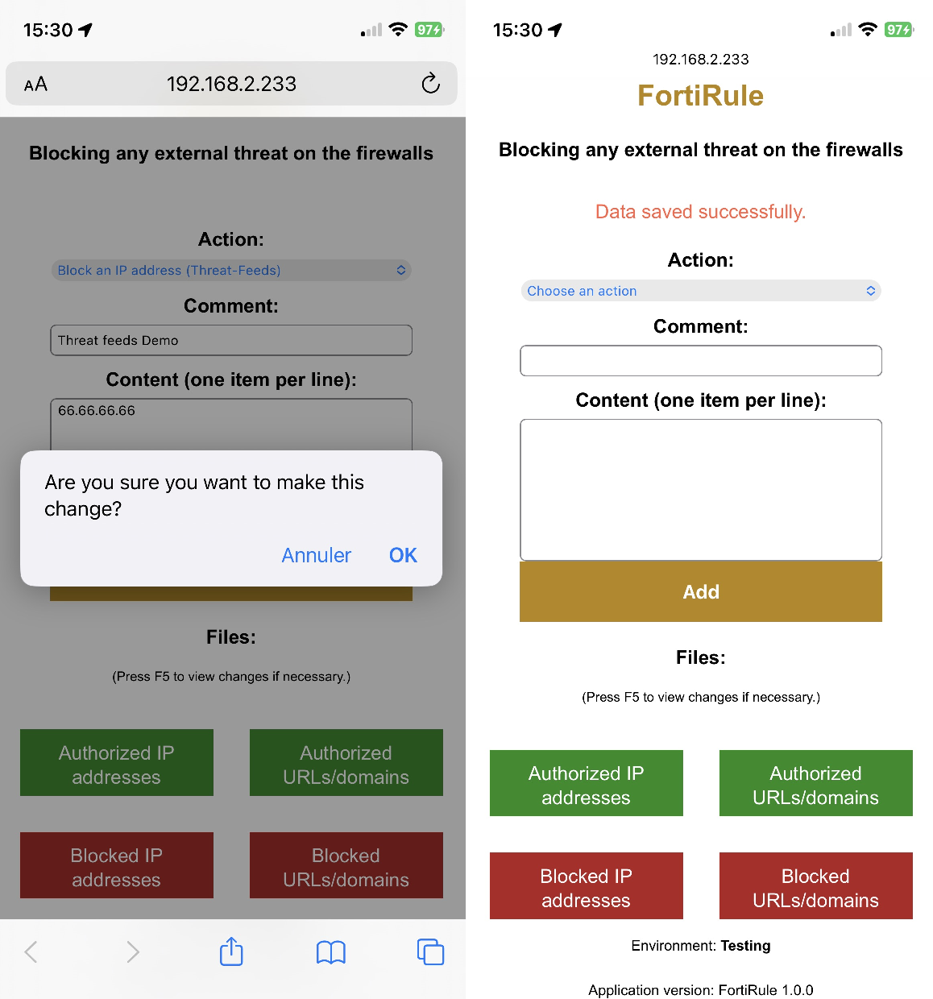
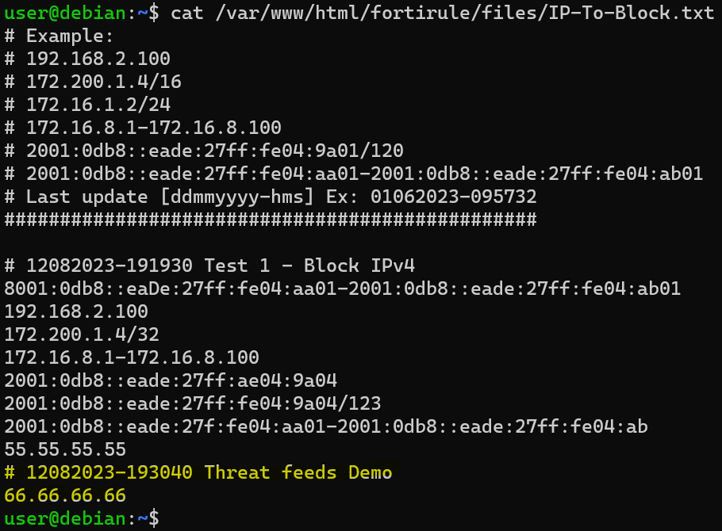

# FortiRule 🔥
[](https://github.com/choupit0/FortiRule/releases/tag/v1.0.0)
[](https://github.com/choupit0/FortiRule/blob/master/LICENSE)
[](https://github.com/choupit0/FortiRule/graphs/commit-activity)
[](https://chat.openai.com/)

**Easily manage blocking any external threat across all your FortiGate firewalls within a minute.**
# Description
FortiRule is a Node.js App to update plain text files used by FortiGate Threat feeds connector to dynamically import an external block list from an HTTP server.

But also to authorize a website, domain, or any IPv4/IPv6 address.

Depending on your time interval to refresh the external resource configured (refresh rate), the applicable threat feed could be done within a minute (default = 5 minutes).

# Application development
This App was largely made with the help of ChatGPT from OpenAI, based on GPT-3.5 model. NPM package.json file were audited with [AuditJS](https://github.com/sonatype-nexus-community/auditjs) and security hardening was performed. But I'm not a full-time Node.js developer, so please be understanding ;) I have documented the code as best as I could.

# Features
**Time-saving, it avoids connecting to the server to make changes in the files and reduces errors:**

- **Updating and formatting plain text files** with UTC timestamping (adding only)
- **Viewing plain text files** (existing content and latest addition)
- 4 text files to **manage blocking threats or unblocking sites**
- **Content control before insertion**:
  - no empty fields,
  - ensure that IPv4/IPv6 addresses & URLs/domains are in the correct format (a message displays the lines with errors),
  - ensure that we have the correct data in the right file (e.g., no IPs in a file meant for URLs),
  - check for duplicates (a message displays the duplicates lines),
- **Request for confirmation before making the change**
- **Content control after insertion**:
  - creating files on-the-fly if they don't exist,
  - concatenate the new data with the existing content,
  - check for duplicates (no changes are applied, a message displays the duplicates lines),
  - automatic backup and cleanup function (retain the last 5 versions of each file with UTC timestamping).
- **Mobile-compatible site**:



On the server:



# Prerequisites & Installation - FortiRule (http)
The FortiRule deployment has been validated on Ubuntu and Debian (latest versions of 64bits). But it should work on other Linux OS as well.

Your server needs to have internet access or access to a local mirror to install the packages.

Remember to open TCP ports 3000 (Node.js server) and 80 (Apache2, http) if there's a firewall between the client and the server.

As an example, here's the procedure to install it on a fresh Debian 12 (as root, and choose SSH + Web server modules during the OS installation):
```
apt update && apt upgrade
apt install nodejs npm -y
nodejs --version && npm --version
```
Now, clone the GitHub repository into the root directory of Apache2 (by default "/var/www/html/"):
```
cd /var/www/html/
git clone https://github.com/choupit0/FortiRule.git
```
Installation of NPM packages:
```
cd /var/www/html/fortirule/srv-nodejs
npm install express http fs fs-extra moment-timezone helmet
```
Provide the IP address or FQDN of your server hosting this Node.js application, line 80 from the Javascript file "/var/www/html/fortirule/js/script.js":
```
vi /var/www/html/fortirule/js/script.js
:%s/fqdn_or_ip/[Please, enter your server IP/FQDN here.]/
:wq
```
Launch the application:
```
/usr/bin/node /var/www/html/fortirule/srv-nodejs/server.js
```
The application is now accessible and fully functional from this URL:
```
http://[your server IP/FQDN]/fortirule/
```
# Prerequisites & Configuration - FortiGate
### External Connectors - Threat Feeds

To use the plain text files generated by FortiRule, you need to create a new External Connector and then choose the Threat Feeds connector (One connector per file type).

An example here with the creation of the External Connectors from CLI (tested on FortiOS 6.4 and 7.0):

```
config system external-resource
    edit "IP-To-Block"
        set type address
        set resource "http://[your server IP/FQDN]/fortirule/files/IP-To-Block.txt"
        set refresh-rate 1
    next
    edit "IP-To-Authorize"
        set type address
        set resource "http://[your server IP/FQDN]/fortirule/files/IP-To-Authorize.txt"
        set refresh-rate 1
    next
    edit "URL-Category-To-Block"
        set category 192
        set resource "http://[your server IP/FQDN]/fortirule/files/URL-Category-To-Block.txt"
        set refresh-rate 1
    next
    edit "URL-Category-To-Authorize"
        set category 193
        set resource "http://[your server IP/FQDN]/fortirule/files/URL-Category-To-Authorize.txt"
        set refresh-rate 1
    next
end
```

I always create these connectors at the "Global" level to use them later in the VDOMs.

**To be continued...**

# Explanatory diagram
**Coming soon.**

# Enhance security - FortiRule (https)
**To encrypt communications, we need to use the HTTPS protocol both at the application level and the Apache2 server level; otherwise, it won't work.**

### Apache2:

Let's enable the SSL module for Apache and SSL site:
```
npm install https
a2enmod ssl
a2ensite default-ssl
```
For the exercise, we will use our own certificate (use your own issuing CA for added security and to avoid alerts):
```
cd /var/www/html/fortirule
mkdir -p ssl ssl/{cert,private}
openssl req -x509 -sha256 -nodes -days 365 -newkey rsa:2048 -keyout private.key -out self.crt
mv self.crt ssl/cert/ && mv private.key ssl/private/
```
Updating the Apache2 sites (Adding paths to the certificate and private key, and redirecting HTTP to HTTPS):
```
vi /etc/apache2/sites-available/default-ssl.conf
```
Uncomment and change the path of these two parameters, then save:
```
SSLCertificateFile      /var/www/html/fortirule/ssl/certs/self.crt
SSLCertificateKeyFile   /var/www/html/fortirule/ssl/private/private.key
:wq
```
Here, we add the directive that enforces the use of HTTPS (Please, provide the address of your server.):
```
vi /etc/apache2/sites-available/000-default.conf
Redirect permanent / https://[your server IP/FQDN]/
:wq
```
Then reload Apache2:
```
systemctl reload apache2
```
The application is now accessible and fully functional from this new URL:
```
https://[your server IP/FQDN]/fortirule/
```
### FortiRule:

Let's install the HTTPS module:
```
cd /var/www/html/fortirule/srv-nodejs
npm install https
```

# Take the application further

### Automatic startup of the application using systemd:

We create a new service:
```
vi /etc/systemd/system/fortirule.service
```
And add this content, save and exit Vi:
```
[Service]
Environment=NODE_ENV=production
Environment=NODE_PORT=3000
WorkingDirectory=/var/www/html/fortirule/srv-nodejs
ExecStart=/usr/bin/node /var/www/html/fortirule/srv-nodejs/server.js
Restart=always

[Install]
WantedBy=multi-user.target
:wq
```
Applying changes, enabling the service, and then starting the application:
```
systemctl daemon-reload
systemctl enable fortirule.service
systemctl start fortirule
```
To check the status of the service and/or the content of the service:
```
systemctl status fortirule
systemctl cat fortirule
```
# What the application does not do
Currently, it's not possible to delete data within the files. And there's no file to handle the hash of malware, the fourth type of threat feeds.

